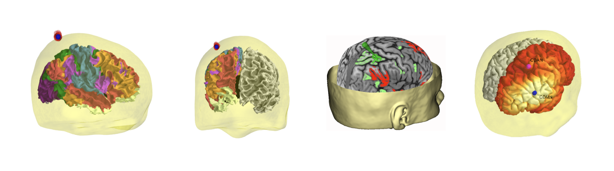

PyNetStim: Brain Network Stimulation Package
===============================================

pynetstim is a python-based package that aims to create an integrated framework for brain network stimulation, stimulation targeting and engagement, stimulation individualization using multimodal imaging.

<h2> Examples</h2>
For examples on how to use pynetstim, take a look at the notebooks under examples directory. List of current examples: 

	1. How to use pynetstim to work with files from brainsight for the purpose of statistical analysis and visualization of TMS pulses.
	

<h2> Contact</h2>
For further information regarding how to use the package,or contributing to the project, please send an email to stadayon@bidmc.harvard.edu

