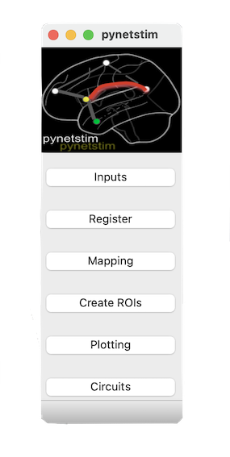

pynetstim
=========

pynetstim is a python-based package that aims to create an integrated framework for circuit-based neuromodulation, neuroanatomical- and functional-based stimulation targeting, and stimulation individualization using multimodal neuroimaging.


	
Dependencies
=============

- python>=3.5
- Scipy
- Nilearn
- Nibabel
- Pysurfer
- Pandas
- Nipype
- MNE
- Mayavi


Install
========

Please make sure you have installed all the dependencies listed above. pynetstim can ben installed by running the following command: 

```
pip install -U --user pynetstim
```


