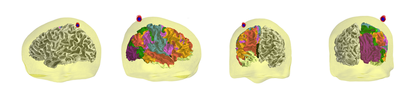

PyNetStim: Brain Network Stimulation Package
===============================================

pynetstim is a python-based package that aims to create an integrated framework for brain network stimulation, stimulation targeting and engagement, stimulation individualization using multimodal imaging.

<h2> Contact</h2>
For further information, please send an email to stadayon@bidmc.harvard.edu

