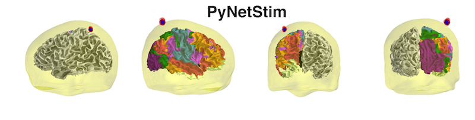

PyNetStim: Brain Network Stimulation Package
===============================================

pynetstim is aiming to create an integrated framework for brain network stimulation and stimulation targeting.The main goal of pynetstim is to provide a framework for ** individualizing stimulation sites by integrating computational modeling, multimodal imaging as well as stimulation simulation**.

	

